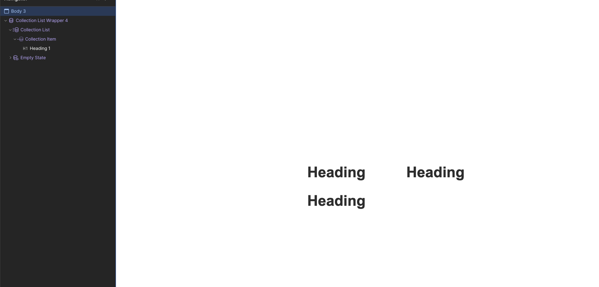

# Event System

## Resource Links

Link to Webflow University:
https://university.webflow.com/

Link To Webflow University - CMS: https://university.webflow.com/videos/build-manage-publish-cms-content

## Quick overview

🧱 Core Concepts

1. Designer
   This is the main visual interface where you build your site.

You use sections, containers, div blocks, and elements (like text, images, buttons).

Think of it as a drag-and-drop version of HTML/CSS.

2. CMS (Content Management System)
   Webflow lets you define collections like Events, Blog Posts, or Team Members.

Each collection has custom fields (like date, title, image).

You can then bind collection data to your design using Collection Lists or Collection Pages.

Example: an “Events” collection might show all upcoming events on a page.

3. Interactions
   You can add animations and triggers (e.g., hover, scroll, page load) to make the site interactive — all without writing JavaScript.

4. Publishing
   With one click, you can publish your site to a Webflow-hosted domain (or your custom domain).

CMS items are updated dynamically — no need to republish the whole site.

⚙️ Event System Use Case (High-Level)
To build an event system:

Create a CMS Collection called Events with fields like Name, Date, Time, Description, Image, Location.

Use a Collection List to display events dynamically on a page.

Style each event using the Designer just like a static layout.

You can also link to a Collection Page for individual event details.

## Step by Step Guide to Creating Events

Note: This guide was written as of July 17, 2025.

## Register, Create, and Proceed to Dashboard

Proceed to Webflow site, register your account, and you should see dashboard like the above picture. Click new site button to proceed.

## Navigate to CMS Dashboard

## Create A Collection

Think of collections attributes as a template for what you categorize. Since we are using events here, we can think of many helpful attributes to define for an event such as an name, a date or a description. Highly recommend to explore what kind of attributes you can define.

1.  Create New Collection Button. When you click this you should see the above screen
2.  Collection URL. This will be the URL path.
3.  Add New field button will allow you to add more attributes or fields to your collection.
4.  Will also bring up a new field just like the Add new Field button.

## Reference Event Settings

Here are the reference fields built out for how we have Events collection defined. Feel free to pick and choose. This is just here as a point of reference.

We created three reference events as an example.

Example of an event

Take notice of all the fields present here. These should line up with the Events collection we have defined earlier. What you currently see above is just a singular instance of an event like a template. Since many events will share these common attributes we can quickly make new events and fill in these fields to make a new event.

Once you have finalized your events, make sure to publish them at the top right. This will allow us to utilize the event collections.

## Back To Design

After clicking the design button you should see a blank screen like above. We want now create a collection image block to fill in the details. We will be following the 3 reference events listed earlier for this example.

## Insert Elements and Create Sample Page

If you have previous experience with HTML, this part may come easy to you. We strongly encourage to view the Webflow videos on the box model and follow the CMS videos if you get stuck as guidelines.

On the side panel, you will notice you can add elements via the Add button or pressing the (A) key.

Directly Below the Add button you will notice the pages. We are going a sample page.

## Insert Collection Wrapper

From the add button you should see Collection List. Click on it and you should now see that the collection list wrapper is present underneath Navigator panel.

Next, lets create a heading block and drag it into the collection. You should see it nested underneath like you see in collection item. Notice the relationship parent child relationship for all of our elements.

After inserting the header block you should see something like above.

Click on a heading block. Notice the purple dot highlighted. This is webflow's way of indiciating that we can bind a collection property to this.

Click on the purple dot and you should see a drop down with a list of fields just like the events we defined earlier. Click on whatever you named Event Name/Title and you should see it affect all three headings.

## Repeat To Create Description

Repeat the earlier methods and put in the description of event. Use a paragraph element this time and it should look something like below.

## Add An docshots/Image

Rinse and repeat for an docshots/image. Select an docshots/image block and you should have something roughly like below.

## Styling

Now is the time you can mix and match your styling. Remember the hiearchy and watch the HTML and CSS videos to get a better understanding.

Suggestions to center would be to apply the following properties in the layout for Collection List and the Collection Item underneath the design panel. Remember when you set the styling inside the collection, it applies to all of them so be sure to take it slow.

- Display: Flex
- Align: Center
- Direction: Down

## Publish

From here you should be able to publish in the top right above. This should create a hosted URL that you can share as a readonly as an example for now. Link to example of published site : https://michaels-marvelous-site-fb9c9b.design.webflow.com/?locale=en&workflow=canvas.

## Additional Info

Please feel free to reach out to us directly if you run into any blockers.
